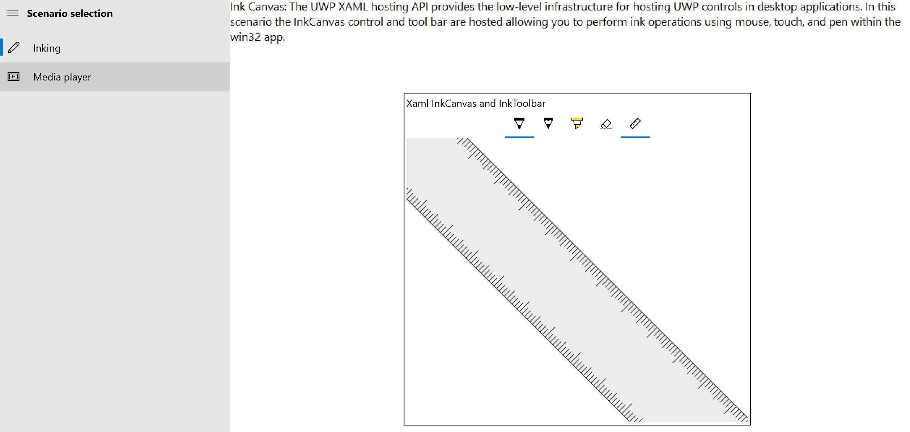
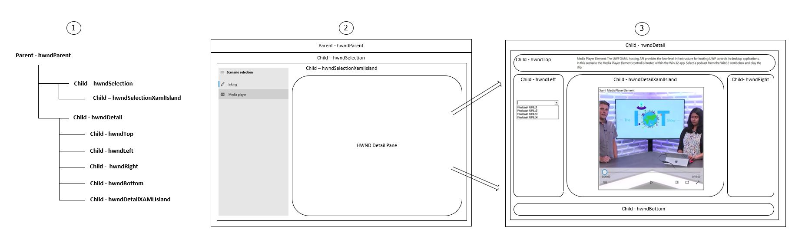

# XAML Hosting API sample

The XAML Hosting API sample is a Win32 Desktop application that demonstrates assorted scenarios using the UWP XAML Hosting API (also known as XAML Islands).

## Highlights
 
- A Windows Desktop application that uses the XAML Hosting API and C++/WinRT to demonstrate the usage of XAML controls within a Win32 context. These are the scenarios demonstrated.
  - Using the Windows Ink UWP feature within a Desktop application.
  - Playing select video files with the UWP Media Player Element control.
  - Handling XAML and native Windows events/messages.
  - Demonstrates basic XAML data binding.

> [!NOTE]
> In the Windows 10 October 2018 Update, the UWP XAML Hosting API is available as a Developer Preview. Although we encourage you to try out this API in your own prototype code now, we don't recommend that you use it in production code at this time. This API, and the sample, will continue to mature and stabilize in future Windows releases.

# Prerequisites

- Windows 10. Minimum supported: Windows 10, version 1809 (10.0; Build 17763), also known as the Windows 10 October 2018 Update.
- [Windows 10 SDK](https://developer.microsoft.com/windows/downloads/windows-10-sdk). Minimum supported: Windows SDK version 10.0.17763.0 (Windows 10, version 1809).
- [Visual Studio 2019](https://visualstudio.microsoft.com/downloads/) (or Visual Studio 2017).

You can optionally install the [C++/WinRT Visual Studio Extension (VSIX)](https://aka.ms/cppwinrt/vsix). When you open the project, it will install the [Microsoft.Windows.CppWinRT NuGet package](https://www.nuget.org/packages/Microsoft.Windows.CppWinRT/).

> [!NOTE]
> This sample is primarily targeted at Windows 10, version 1809 (10.0; Build 17763), also known as the Windows 10 October 2018 Update. However, we did some testing on the Windows 10, version 1903 (10.0; Build 18343) [Insider Preview](https://www.microsoft.com/software-download/windowsinsiderpreviewiso), and it worked after we added the `maxversiontested` element in the application manifest. But there were issues with the Reveal effects. As a workaround, the transparency effects were disabled in the OS Settings; meanwhile the Product Feature team is finishing the work.

# App architecture

This sample is a *gallery-style* project, which incorporates Universal Windows Platform (UWP) controls into a Win32 Desktop application. Currently, the following controls are used.

- Windows Ink Canvas and Ink Toolbar.
- Media Player Element.
- Navigation View.

The presentation is module-based, and you can click through each of the supported XAML UI scenarios via the Navigation View control. The Navigation View control is a hosted XAML UI element, which wraps all HWND/XAML content to provide a functional, and themed, UWP navigation experience. The diagram below illustrates the parent and child HWND layout, and the hosted XAML UI.

1. The HWND parent/child hierarchy in the sample.
2. The parent **HWND (hwndParent)** contains two child windows. The first, **hwndSelection**, holds the child **hwndSelectionXamlIsland**, which hosts the XAML Navigation View control.
3. The second child of **hwndParent**, **hwndDetail**, is not bound to the Navigation View content property, and the window is overlaid onto the **HWND Detail Pane** region depicted in the second callout. This HWND contains windows for Win32 controls, as well as a window for containing XAML UI controls.

# Code at a glance

If you're interested in just code snippets for certain areas, and you don't want to browse nor run the full sample, then you can check out the following functions. The source code for this project is located in [Main.cpp](XamlDemoGallery/XamlDemoGallery/Main.cpp#L10).

- **WindowInit**. Defines and registers WNDCLASS structs for windows, creates the windows including the window for hosting the XAML Navigation View control, and displays the navigation UI.
- **CreateSelectionMenu**. This function returns a XAML grid UI element that contains the Navigation View control. This XAML is hosted in **hwndSelectionXamlIsland**. The function also registers handlers for these three events.
    - **NavigationView.Loaded**. This handler sets the default Navigation View item, and lays out the child windows of **hwndDetail** that overlay the HWND Detail Pane region.
    - **NavigationView.SelectionChanged**. This handler determines the items selected in the Navigation View, and loads the appropriate Win32 and XAML UI module in the detail window.
    - **Frame.SizeChanged**. This handler responds to **hwndParent** size changes, and updates the detail windows appropriately.
- **CreateInkCanvas**. Creates the **InkCanvas** and **InkToolbar** controls. It creates and returns a XAML UI element, which is hosted in **hwndDetailXamlIsland.**
- **CreateMediaPlayer**. Creates the UWP **MediaPlayerElement** control. It creates and returns a XAML UI element, which is hosted in **hwndDetailXamlIsland.**
- **LoadModule**. Sets the appropriate XAML for hosting based on Navigation View selection.

# Known Issues

- The Media Player Element control can't be maximized to full screen in the **Media Player** module at this time. The control disappears if you do that, and you'll need to click out of the module and back to restore the view.

# Your contributions

This project welcomes your contributions and suggestions. Most contributions require you to agree to a Contributor License Agreement (CLA) declaring that you have the right to, and actually do, grant us the rights to use your contribution. For details, visit https://cla.microsoft.com.

When you submit a pull request (PR), a CLA-bot automatically determines whether you need to provide a CLA, and decorates the PR appropriately (for example, label, comment). Simply follow the instructions provided by the bot. You will need to do this only once across all repos using our CLA.

This project has adopted the [Microsoft Open Source Code of Conduct](https://opensource.microsoft.com/codeofconduct/). For more information see the [Code of Conduct FAQ](https://opensource.microsoft.com/codeofconduct/faq/), or contact [opencode@microsoft.com](mailto:opencode@microsoft.com) with any additional questions or comments.

# See also

- [C++/WinRT](https://docs.microsoft.com/en-us/windows/uwp/cpp-and-winrt-apis/)
- [Using the UWP XAML Hosting API](https://docs.microsoft.com/windows/uwp/xaml-platform/using-the-xaml-hosting-api)
- [DesktopWindowXamlSource](https://docs.microsoft.com/en-us/uwp/api/windows.ui.xaml.hosting.desktopwindowxamlsource)
